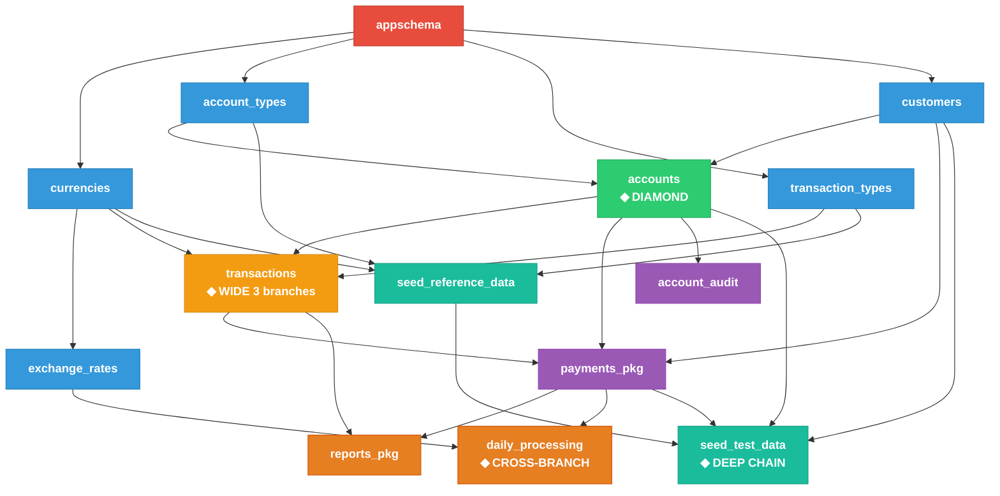

# Sqitch + Oracle 11g — Proof of Concept

## Описание

Проект проверки концепции миграции SQL-скриптов через [Sqitch](https://sqitch.org) в Oracle 11g.
Демонстрирует DAG-подход к управлению зависимостями миграций на примере
транзакционного платёжного приложения.

## Docker-образы

| Компонент | Образ | Описание |
|-----------|-------|----------|
| **Oracle DB** | `gvenzl/oracle-xe:11-slim` | Oracle XE 11.2.0.2, Gerald Venzl (Oracle DevRel), 10M+ pulls |
| **Sqitch** | Собственная сборка | `oraclelinux:8-slim` + Oracle Instant Client 19c + Sqitch + DBD::Oracle |

> **Почему Oracle XE 11.2.0.2 а не 11.2.0.4?**
> Oracle 11.2.0.4 EE/SE требует лицензионные бинарники Oracle для сборки образа.
> PL/SQL-совместимость между 11.2.0.2 и 11.2.0.4 **идентична** — разница только в
> патчах безопасности (PSU/CPU). Для PoC миграций это не имеет значения.

> **Почему Oracle Instant Client 19c?**
> 19c — последняя версия Instant Client, поддерживающая Oracle 11g.
> Начиная с 21c минимальная версия сервера — 12.1.

## Граф зависимостей (DAG)



### Типы зависимостей продемонстрированные в проекте

| Тип | Пример | Описание |
|-----|--------|----------|
| **DIAMOND** | `accounts` ← `customers` + `account_types` | Две ветки сходятся в одну точку |
| **WIDE** | `transactions` ← 3 ветки | Зависимость от 3 независимых веток |
| **CROSS-BRANCH** | `daily_processing` ← `payments_pkg` + `exchange_rates` | Соединение двух ранее независимых веток |
| **DEEP CHAIN** | `seed_test_data` → 6 уровней | Глубокая цепочка зависимостей |

## Быстрый старт

```bash
# 1. Клонировать/скопировать проект
cd sqitch-oracle-poc

# 2. Запустить полный PoC (Oracle + Sqitch + все миграции)
chmod +x scripts/run-poc.sh
./scripts/run-poc.sh

# --- ИЛИ пошагово ---

# 2a. Собрать и запустить контейнеры
docker compose up -d --build

# 2b. Дождаться готовности Oracle (~1-3 минуты)
docker compose exec sqitch bash -c '
  until echo "SELECT 1 FROM DUAL;" | sqlplus -S payment_app/PayApp2025@//oracle-db:1521/XE 2>/dev/null | grep -q "1"; do
    echo "Waiting for Oracle..."; sleep 5;
  done; echo "Oracle ready!"
'

# 2c. Применить все миграции
docker compose exec sqitch sqitch deploy -vvv

# 2d. Верифицировать
docker compose exec sqitch sqitch verify

# 2e. Посмотреть статус
docker compose exec sqitch sqitch status
```

## Ключевые команды Sqitch

```bash
# Сокращение для удобства
alias sq='docker compose exec sqitch sqitch'

sq status                       # Текущий статус
sq log                          # Лог применённых миграций
sq log --format format:%h' '%n  # Компактный лог
sq deploy                       # Применить все неприменённые
sq deploy --to accounts         # Применить до accounts (включая зависимости!)
sq verify                       # Проверить все миграции
sq revert --to appschema -y     # Откатить до appschema
sq revert -y                    # Откатить ВСЁ
sq deploy && sq verify          # Полный цикл
```

## Структура проекта

```
sqitch-oracle-poc/
├── docker-compose.yml              # Оркестрация: Oracle + Sqitch
├── docker/
│   └── Dockerfile.sqitch           # Sqitch + Oracle Instant Client 19c
├── sqitch.conf                     # Конфигурация Sqitch
├── sqitch.plan                     # ★ DAG миграций (14 changes)
├── deploy/                         # Скрипты применения
│   ├── appschema.sql               # Уровень 0: корень
│   ├── currencies.sql              # Уровень 1: справочник валют
│   ├── account_types.sql           # Уровень 1: типы счетов
│   ├── transaction_types.sql       # Уровень 1: типы операций
│   ├── customers.sql               # Уровень 1: клиенты
│   ├── accounts.sql                # Уровень 2: ◆ DIAMOND
│   ├── exchange_rates.sql          # Уровень 2: курсы валют
│   ├── transactions.sql            # Уровень 3: ◆ WIDE (3 ветки)
│   ├── payments_pkg.sql            # Уровень 4: PL/SQL пакет платежей
│   ├── account_audit.sql           # Уровень 4: compound trigger
│   ├── reports_pkg.sql             # Уровень 5: аналитика
│   ├── daily_processing.sql        # Уровень 5: ◆ CROSS-BRANCH
│   ├── seed_reference_data.sql     # Уровень 6: справочные данные
│   └── seed_test_data.sql          # Уровень 6: ◆ DEEP CHAIN
├── revert/                         # Скрипты отката (по одному на каждый deploy)
│   └── ...
├── verify/                         # Скрипты проверки
│   └── ...
├── scripts/
│   ├── init-oracle-user.sql        # Инициализация Oracle (автозапуск)
│   └── run-poc.sh                  # Полный цикл PoC
└── README.md
```

## Особенности Oracle 11g PL/SQL в миграциях

Проект специально использует конструкции, специфичные для Oracle 11g:

| Конструкция | Где используется | Комментарий |
|-------------|-----------------|-------------|
| `CREATE SEQUENCE` + триггер | Все таблицы | 11g: нет IDENTITY столбцов |
| `COMPOUND TRIGGER` | account_audit | Введён в Oracle 11g |
| `VIRTUAL COLUMN` | account_audit_log | Доступен с 11.1 |
| `BULK COLLECT` / `FORALL` | payments_pkg | Массовые операции |
| `PRAGMA AUTONOMOUS_TRANSACTION` | payments_pkg | Автономные транзакции |
| `SYS_REFCURSOR` | reports_pkg | Возврат курсоров |
| `RESULT_CACHE` | reports_pkg | Кэширование результатов (11g) |
| `LISTAGG` | reports_pkg | Агрегация строк (11.2+) |
| `ROWNUM` для limit | reports_pkg | 11g: нет FETCH FIRST |
| `FOR UPDATE SKIP LOCKED` | payments_pkg | Пропуск заблокированных |
| `RETURNING INTO` | payments_pkg | Получение значений после INSERT |
| `RAWTOHEX(SYS_GUID())` | transactions | Генерация UUID |
| `set serveroutput on` | Все скрипты | SQL*Plus-специфичная команда |
| `show errors` | Все пакеты/триггеры | SQL*Plus-специфичная команда |
| `/` | Все PL/SQL-блоки | SQL*Plus-разделитель блоков |

## Troubleshooting

### Oracle Instant Client версия не найдена

Если при сборке ошибка `No match for argument: oracle-instantclient19.25-*`:

```dockerfile
# В docker/Dockerfile.sqitch замените версию:
# Раскомментируйте блок автопоиска (строки 22-26)
```

### Oracle XE долго запускается

Первый запуск создаёт БД — это может занять 2-5 минут:

```bash
docker compose logs -f oracle-db  # Следить за прогрессом
# Ждать: "DATABASE IS READY TO USE!"
```

### Ошибка подключения Sqitch к Oracle

```bash
# Проверить что Oracle работает
docker compose exec sqitch sqlplus payment_app/PayApp2025@//oracle-db:1521/XE

# Проверить что tnsnames доступен
docker compose exec sqitch tnsping //oracle-db:1521/XE
```

### ORA-01017: invalid username/password

Если `APP_USER` не создался автоматически, создайте вручную:

```bash
docker compose exec oracle-db sqlplus sys/SysPassword123@localhost:1521/XE as sysdba
```

```sql
CREATE USER payment_app IDENTIFIED BY PayApp2025;
GRANT CONNECT, RESOURCE, DBA TO payment_app;
GRANT UNLIMITED TABLESPACE TO payment_app;
```

## Подключения

| Параметр | Значение |
|----------|----------|
| Host | `localhost` (с хоста) / `oracle-db` (из контейнера) |
| Port | `1521` |
| SID | `XE` |
| App User | `payment_app` / `PayApp2025` |
| SYS | `sys` / `SysPassword123` |
